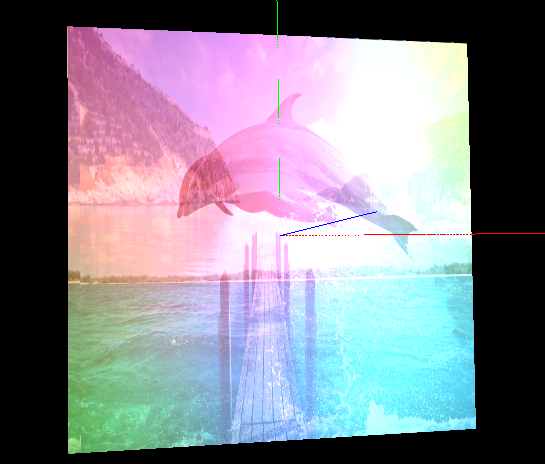
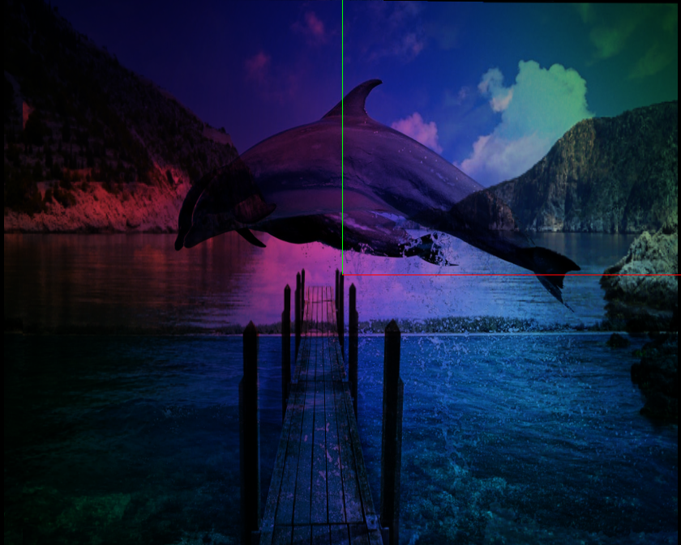

## Report 1
Members: Floyd R, Fei Xu, Minh Truong

Above is three images we chose for this assignment.

Since the given multi texture code from instructor only handles two textures, we create a new class called Triple_Texture which reuses some source code and is able to handle three textures. The process of adding new texture is simply to copy and paste code used to generating previous two textures, the texture coordinate is kept the same.

In the first blending, to emphasize the color background, we use the following blending function:

`color = 0.1 * pass_Color + 0.3 * tex_color +  0.8 * tex_color_light +  0.4 * tex_color_extra;`

tex_color_extra is the color of the third texture, and it results in  the below image:

In the second blending, we reuse the blending function given by instructor

`color = tex_color * tex_color_light * tex_color_extra`

And it results in the following image:

When we use the multiplication without considering vertex color, the result seems to be more clear about how images are merged together. 
