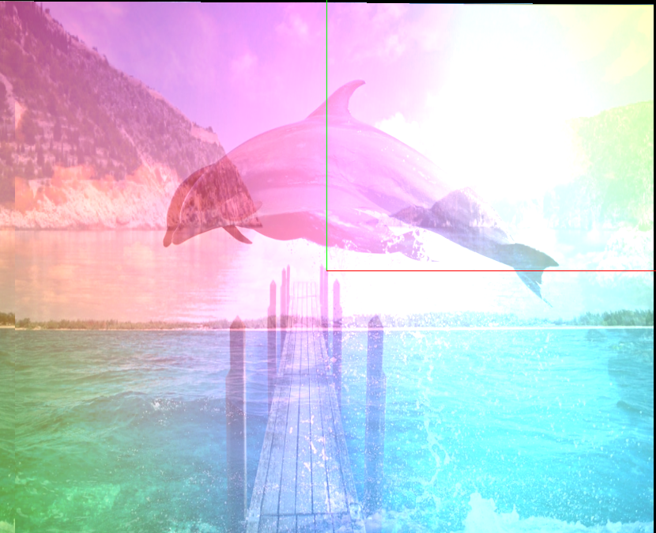

## Report 1
Members: Floyd R, Fei Xu, Minh Truong

Above are the three images we chose for this assignment.

Since the given multi texture code from instructor only handles two textures, we create a new class called Triple_Texture which reuses some source code and is able to handle three textures. The process of adding new texture is to simply to copy and paste code used to generating previous two textures. The texture coordinate is kept the same.

In the first blending, to emphasize the color background, we use the following blending function:

`color = 0.1 * pass_Color + 0.3 * tex_color +  0.8 * tex_color_light +  0.4 * tex_color_extra;`

tex_color_extra is the color of the third texture, and it results in the below image:

In this blending method, the images are directly overlaid, as though alpha values are used.  Priority is given to tex_color_light, but all features survive blending.

In the second blending, we reuse the blending function given by instructor

`color = tex_color * tex_color_light * tex_color_extra`

And it results in the following image:

When we use the multiplicative blending method, areas that are dark in one image are dark regardless of what is in the other images. The same applies to areas that are not blue, areas that are not green, and areas that are not red.  This leaves only the areas that have colors in common or are largely white in one image.

One notice about implementation is that because our Triple_texture class inherits GLTexture and being used ing GLAppearance so we found that it needs to be placed in gl_common to be able to compiled together with GLTexture and GLAppearance so we placed TripleTexture.cpp and TripleTexture.h in gl_common
